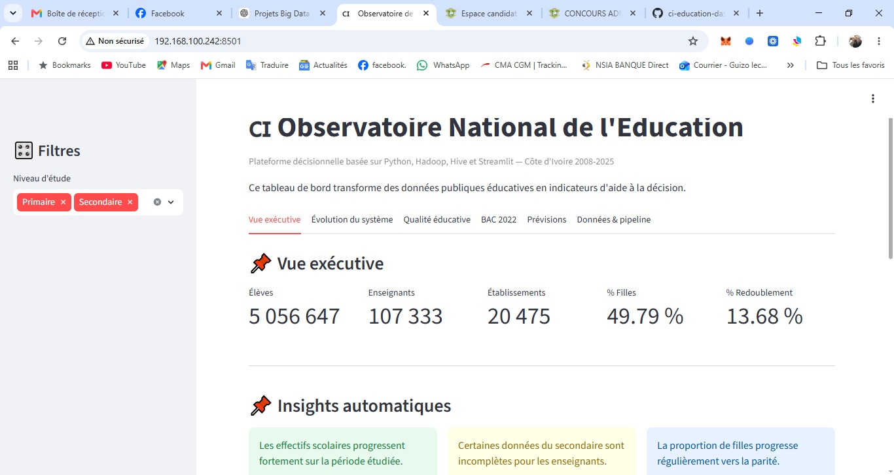
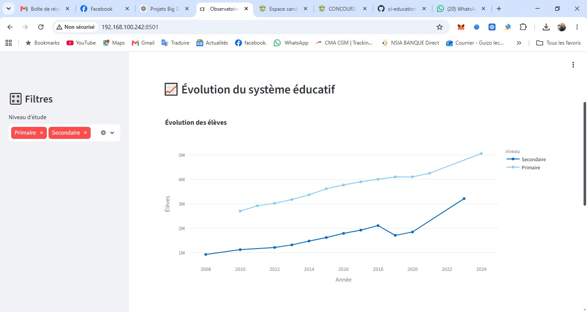
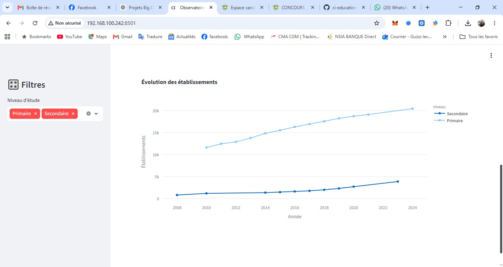
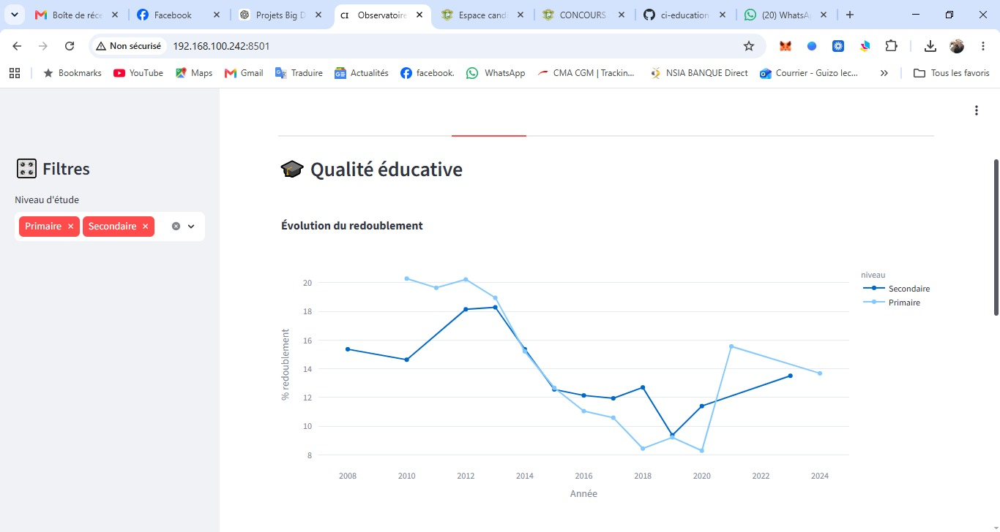
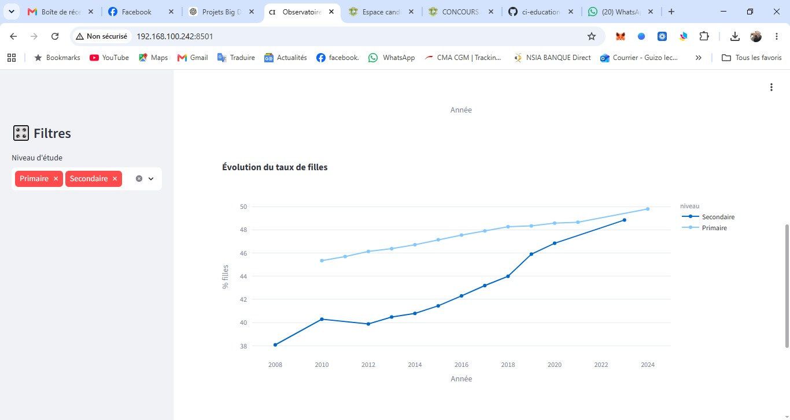
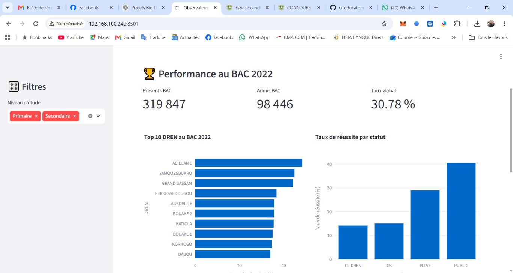
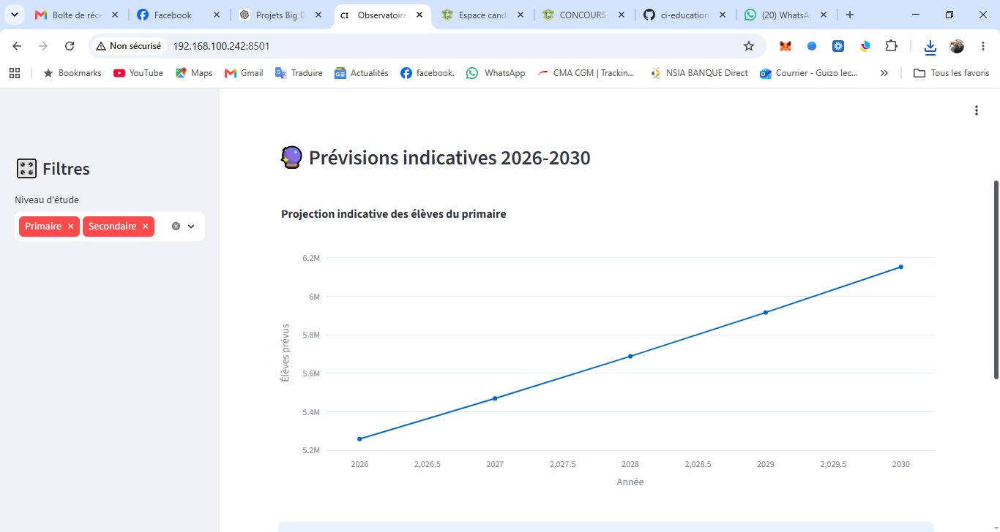

# CI Observatoire National de l'Education

Plateforme decisionnelle basee sur Python, Pandas, Plotly et Streamlit pour l'analyse des donnees publiques de l'education en Cote d'Ivoire.

## Objectif

Transformer les donnees educatives ouvertes en indicateurs d'aide a la decision pour :

* Le suivi des effectifs scolaires
* L'analyse des enseignants
* Le suivi des etablissements
* L'evaluation de la parite filles-garcons
* L'analyse du redoublement
* Le suivi des performances au BAC
* Les previsions educatives

## Technologies utilisees

* Python
* Pandas
* NumPy
* Plotly
* Streamlit

## Donnees utilisees

### Enseignement primaire

* Statistiques nationales 2010-2025

### Enseignement secondaire

* Statistiques nationales 2008-2024

### BAC 2022

* Classement des etablissements
* Analyse par DREN
* Analyse par statut

## Fonctionnalites

### Vue executive

* KPI nationaux
* Score synthetique de suivi educatif
* Insights automatiques

### Evolution du systeme educatif

* Evolution des eleves
* Evolution des enseignants
* Evolution des etablissements

### Qualite educative

* Evolution du redoublement
* Evolution du taux de filles

### BAC 2022

* Top 10 DREN
* Taux de reussite par statut
* Top 20 etablissements

### Previsions

* Projection indicative des effectifs scolaires (2026-2030)

## Installation

Installer les dependances :

```bash
pip install -r requirements.txt
```

Lancer l'application :

```bash
streamlit run app.py
```

Puis ouvrir :

```text
http://localhost:8501
```

## Structure du projet

```text
EduDataCI/
|
|-- app.py
|-- requirements.txt
|-- dashboard_education_ci.csv
|-- education_ci_master.csv
|-- education_ci_master_clean.csv
|-- education_ci_master_v2.csv
|-- bac_2022_analyse_par_dren.csv
|-- bac_2022_analyse_par_statut.csv
|-- bac_2022_top20_etablissements.csv
|-- top10_dren_bac.csv
|-- KPI.pdf
|
`-- docs/
    `-- screenshots/
        |-- dashboard-home.jpeg
        |-- evolution_eleve.jpeg
        |-- evolution_etablissement.jpeg
        |-- evolution_redoublement.jpeg
        |-- evolution_taux_filles.jpeg
        |-- Bac2022.jpeg
        `-- prevision2030.jpeg
```

## Perspectives

* Integration Hadoop/HDFS
* Integration Hive
* Integration Spark
* Mise a jour automatique des donnees
* Cartographie interactive des DREN
* Analyse predictive avancee

## Auteur

ANON Amoncou Diom Sebastien

Master 1 Base de Donnees et Genie Logiciel (BDGL)

Universite Felix Houphouet-Boigny (UFHB)

Data and AI Enthusiast

Passionne de Data Engineering, Big Data et Intelligence Artificielle.

## Apercu du Dashboard

### Tableau de bord principal



### Evolution des effectifs scolaires



### Evolution des etablissements



### Evolution du redoublement



### Evolution du taux de filles



### Analyse BAC 2022



### Prevision des effectifs a l'horizon 2030


